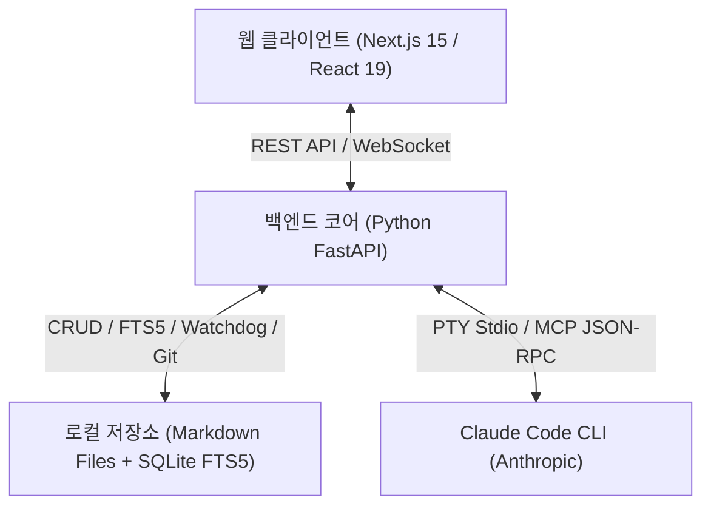

# 🧠 LLM-Wiki Web & Claude Code CLI 연동 서비스

> **주제(Topic)별 위키 지식 베이스를 관리하고, 웹 인터페이스로 탐색하며, Claude Code CLI와 연동하여 대화형으로 지식을 구축·확장하는 풀스택 서비스**

---

## 🌟 주요 기능 (Key Features)

1. **주제(Topic)별 위키 저장소 관리**
   - 연구/프로젝트/학습 주제별 독립된 Markdown 디렉토리 생성 및 관리 (`data/wikis/[topic-name]/`)
   - `watchdog` 기반 **로컬 파일 실시간 감시(File Watcher)**: VS Code, Obsidian 등 외부 편집기에서 수정한 내용이 웹에 실시간 반영

2. **모던 위키 웹 인터페이스 (Next.js 15 App Router)**
   - **풍부한 마크다운 렌더링**: GFM(GitHub Flavored Markdown), KaTeX 수식($E[U] = \sum \gamma^t R$), Mermaid 다이어그램, 코드 하이라이팅
   - **양방향 위키링크 & Backlinks**: `[[문서명]]` 및 `[[대상|라벨]]` 위키링크 자동 연결 및 현재 문서를 참조하는 역방향 링크 목록 실시간 탐색
   - **분할 뷰(Split View) 마크다운 에디터**: 실시간 미리보기 및 `Ctrl+S` 단축키 지원

3. **인터랙티브 2D/3D 지식 그래프 (Knowledge Graph)**
   - 문서와 개념 간의 연결 관계를 Force-directed Graph로 시각화
   - 노드 클릭 시 해당 문서로 즉시 이동, 줌/확대/축소 및 클러스터 탐색

4. **하이브리드 지식 검색 엔진 (Hybrid Search - `Ctrl+K`)**
   - SQLite FTS5 기반 키워드/BM25 전문 검색
   - 시맨틱 벡터 유사도 검색 결합
   - RRF(Reciprocal Rank Fusion) 랭킹 알고리즘 적용

5. **Claude Code CLI 연동 (하이브리드 인터페이스 & 내장 MCP 서버)**
   - **하이브리드 뷰**: 깔끔한 대화형 메신저 채팅 UI ↔ `xterm.js` 풀 컬러 가상 터미널 모드 원클릭 전환
   - **내장 MCP(Model Context Protocol) 서버**: Claude Code CLI가 `search_wiki`, `read_wiki_page`, `write_wiki_page`, `get_backlinks` 도구를 자율적으로 호출하여 위키 지식 생성 및 수정

6. **외부 Git 저장소 Clone 임포트 & 원격 동기화 (Git Pull)**
   - GitHub, GitLab, GitHub Wiki 등 원격 Markdown 저장소 URL을 통한 신규 토픽 원클릭 복제
   - 복제 즉시 SQLite FTS5 전문 검색 및 지식 그래프에 마크다운 문서 자동 색인
   - 사이드바 내 원클릭 `Git Pull` 동기화 버튼으로 원격 변경사항 실시간 반영

---

## 🏗️ 아키텍처 (Architecture)



---

## 🚀 빠른 시작 (Quick Start)

### 1. 사전 요구사항
- Python 3.11+ (Python 3.13 지원)
- Node.js 18+ (Node.js 24 지원)
- (선택) Claude Code CLI: `npm install -g @anthropic-ai/claude-code`

### 2. 실행 방법 (원클릭)
Windows 환경에서는 루트 디렉토리의 배치 파일을 더블클릭하거나 터미널에서 실행합니다:

```cmd
.\start-all.bat
```

또는 개별 실행:

#### 백엔드 실행 (Port 8000)
```cmd
.\start-backend.bat
```

#### 프론트엔드 실행 (Port 3000)
```cmd
.\start-frontend.bat
```

브라우저에서 **`http://localhost:3000`** 접속!

---

## 🧪 테스트 실행 (Testing)

백엔드 유닛 및 통합 테스트 실행:
```cmd
.\backend\.venv\Scripts\python.exe -m pytest backend/tests -v
```

---

## 📚 관련 문서
- [docs/01_REQUIREMENTS_SPECIFICATION.md](docs/01_REQUIREMENTS_SPECIFICATION.md) : 요구사항 정의서
- [docs/02_SYSTEM_ARCHITECTURE.md](docs/02_SYSTEM_ARCHITECTURE.md) : 시스템 아키텍처 설계서
- [docs/03_DEPLOYMENT_GUIDE.md](docs/03_DEPLOYMENT_GUIDE.md) : 배포 및 운영 가이드 (Docker, Nginx SSL, wiki.k71style.xyz, CI/CD)
- [docs/04_WORK_HISTORY.md](docs/04_WORK_HISTORY.md) : 프로젝트 작업 이력 및 개발 일지 (기능 구현, 아키텍처 결정, 개발 가이드)
