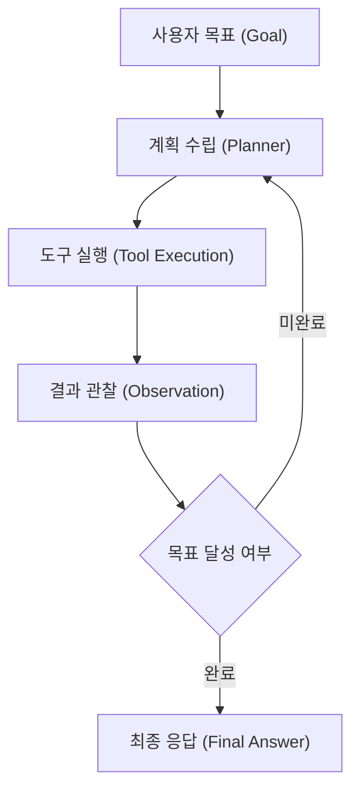

# 자율형 에이전트 시스템 (Autonomous Agents)

자율형 에이전트는 목표(Goal)가 주어졌을 때 환경을 인지(Perception)하고, 계획을 수립(Planning)하며, 도구를 활용(Action/Tool Use)하여 스스로 문제를 해결하는 AI 시스템입니다.

## 🏗️ 핵심 구성 요소
1. **Planning (계획 수립)**: 작업을 세부 하위 작업으로 분해하고 반성(Reflection)을 수행.
2. **Memory (메모리)**: 단기 메모리(대화 컨텍스트) 및 장기 메모리(벡터 DB / [[RAG vs Agentic Workflow]]).
3. **Tool Use (도구 활용)**: 외부 API 및 CLI, [[Tool Use and MCP|MCP(Model Context Protocol)]] 도구 호출.

## 🔄 에이전트 추론 루프 (ReAct Loop)

## 📐 최적화 수식 (KaTeX)
에이전트의 목표 기대 효용 함수는 다음과 같이 표현할 수 있습니다:
$$E[U] = \sum_{t=0}^{T} \gamma^t R(s_t, a_t)$$

여기서 $\gamma \in [0, 1)$ 는 감가율(discount factor)이며, $R(s_t, a_t)$ 는 상태 $s_t$ 에서 행동 $a_t$ 를 취했을 때의 보상입니다.

## 🔗 연관 문서
- [[INDEX.md|위키 홈으로 돌아가기]]
- [[RAG vs Agentic Workflow]]
- [[Tool Use and MCP]]
