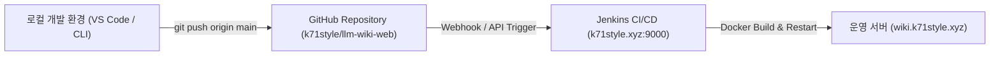

# 📋 프로젝트 작업 이력 및 기술 개발 일지 (Work History)

> **다른 컴퓨터나 새로운 개발 환경에서 본 저장소를 열었을 때, 지금까지 진행된 주요 작업 내역, 아키텍처 의사결정, 배포 설정 및 검증 결과를 한눈에 파악할 수 있도록 기록된 종합 기술 문서입니다.**

---

## 📌 목차
1. [최근 작업 요약 (Milestones Overview)](#1-최근-작업-요약-milestones-overview)
2. [세부 작업 내역 (Detailed Work Log)](#2-세부-작업-내역-detailed-work-log)
   - [A. zzooni4 메인 서비스 SSO 통합 인증 연동](#a-zzooni4-메인-서비스-sso-통합-인증-연동)
   - [B. Claude Code CLI Linux PTY 가상 터미널 및 환경 영속화](#b-claude-code-cli-linux-pty-가상-터미널-및-환경-영속화)
   - [C. SQLite 3 + FTS5 전문 검색 및 지식 그래프 구축](#c-sqlite-3--fts5-전문-검색-및-지식-그래프-구축)
   - [D. 외부 Git 저장소 Clone 임포트 & 원격 동기화 (Git Pull)](#d-외부-git-저장소-clone-임포트--원격-동기화-git-pull)
3. [인프라 & CI/CD 파이프라인 현황](#3-인프라--cicd-파이프라인-현황)
4. [새로운 환경/컴퓨터에서의 실행 및 개발 가이드](#4-새로운-환경컴퓨터에서의-실행-및-개발-가이드)

---

## 1. 최근 작업 요약 (Milestones Overview)

| 일자 (Time) | 작업 주제 | 주요 변경 파일 및 컴포넌트 | 핵심 내용 및 성과 |
| :--- | :--- | :--- | :--- |
| **2026-09-18** | **Git 저장소 임포트 & 원격 Pull 동기화** | `backend/app/services/topic_service.py`<br>`backend/app/api/routers/topics.py`<br>`frontend/src/components/topic/create-topic-dialog.tsx`<br>`frontend/src/components/layout/sidebar.tsx` | - GitHub/GitLab 등 원격 Git 저장소 URL Clone 및 신규 토픽 생성<br>- Markdown 문서 파싱 및 SQLite FTS5 자동 색인<br>- 사이드바 내 원클릭 Git Pull 동기화 기능 |
| **2026-09-18** | **Claude Code CLI Linux PTY 터미널 개선** | `backend/app/services/claude_pty.py`<br>`docker-compose.yml`<br>`backend/Dockerfile` | - Docker 컨테이너 환경에서 실제 Linux PTY(`pty.openpty()`) 연동 (`isTTY === true` 보장)<br>- Claude 설정 영속 볼륨(`llm-wiki_claude_config`) 마운트 |
| **2026-09-17** | **zzooni4 통합 SSO 연동 및 JWT HS512 지원** | `backend/app/security/jwt_auth.py`<br>`backend/app/core/config.py`<br>`backend/app/api/routers/auth.py` | - `k71style.xyz` 도메인 공유 쿠키(`jwtToken`) 기반 SSO 인증<br>- `HS512` 알고리즘 디코딩 및 관리자(`ADMIN`, `ROLE_ADMIN`) 자동 인가 |
| **2026-09-17** | **SQLite 3 + FTS5 & Watchdog 하이브리드 엔진** | `backend/app/db/database.py`<br>`backend/app/services/index_service.py` | - 파일 기반 고속 SQLite FTS5 전문 검색(BM25) 및 백링크 그래프<br>- 로컬 파일 실시간 변경 감시(`watchdog`) 및 동기화 |

---

## 2. 세부 작업 내역 (Detailed Work Log)

### A. zzooni4 메인 서비스 SSO 통합 인증 연동

* **배경 & 목적**:
  - 메인 포털 `https://k71style.xyz`(`zzooni4`, Spring Boot + Next.js)에서 로그인한 세션(JWT 쿠키)을 서브도메인 `https://wiki.k71style.xyz`(`llm-wiki-web`)에서도 그대로 공유하여 별도 로그인 없이 통합 접근할 수 있도록 구성.
* **구현 세부사항**:
  1. **쿠키 규격 표준화**: RFC 6265 표준에 따라 `jwtToken` 쿠키의 `Domain`을 `k71style.xyz`로 설정하여 모든 서브도메인에서 쿠키 자동 전송.
  2. **HS512 JWT 서명 디코딩**: `backend/app/security/jwt_auth.py`에서 Spring Boot 백엔드가 발급하는 `HS512` 알고리즘과 비밀키(`JWT_SECRET_KEY`)를 통해 서명을 직접 검증.
  3. **인가 체계**: JWT Payload 내 `roles` 배열 또는 단일 문자열에서 `ADMIN`, `ROLE_ADMIN`을 추출하여 `is_admin=True` 권한 부여. 비로그인 사용자 및 일반 사용자의 접근 제어 지원.
  4. **로그아웃 처리**: 로그아웃 시 `k71style.xyz` 도메인 쿠키를 삭제하도록 Response Header 전송.

---

### B. Claude Code CLI Linux PTY 가상 터미널 및 환경 영속화

* **배경 & 목적**:
  - 웹 인터페이스 내에서 Anthropic의 `claude` CLI를 대화형/풀스크린 터미널로 제어하기 위함.
  - 단순 `subprocess.Popen(PIPE)` 방식은 Node.js 기반 Claude Code CLI의 TTY 감지(`process.stdin.isTTY`)에 실패하여 실행이 중단되는 문제 발생.
* **구현 세부사항**:
  1. **진짜 가상 터미널(Linux PTY) 구현 (`backend/app/services/claude_pty.py`)**:
     - Python 표준 라이브러리 `pty.openpty()`를 활용하여 마스터/슬레이브 파일 디스크립터 생성.
     - `TIOCSWINSZ` (`termios` / `fcntl`)를 통해 프론트엔드 `xterm.js`의 행/열(rows/cols) 크기 변경을 동적으로 터미널에 전달.
     - WebSocket을 통해 바이너리/텍스트 I/O를 실시간 양방향 스트리밍.
  2. **환경 설정 영속성 (Docker Volume)**:
     - 컨테이너가 재배포되더라도 Claude 인증 상태(`oauth` 토큰) 및 세션이 유지되도록 Docker Named Volume `llm-wiki_claude_config`를 `/root/.claude`에 마운트.
     - `CLAUDE_CONFIG_DIR=/root/.claude` 환경변수 주입.

---

### C. SQLite 3 + FTS5 전문 검색 및 지식 그래프 구축

* **배경 & 목적**:
  - 대규모의 무거운 DB(PostgreSQL, ElasticSearch, Pinecone 등) 없이도 가볍고 설치가 필요 없는 단일 파일 기반 고성능 검색 및 위키 지식 그래프를 구성.
* **구현 세부사항**:
  1. **SQLite 3 + FTS5 전문 검색 테이블**:
     - `pages_fts` 가상 테이블을 생성하고 `unicode61` 토크나이저 적용.
     - BM25 점수 기반의 키워드 랭킹 정렬 및 하이라이팅 기능 제공.
  2. **마크다운 링크 파서 & 지식 그래프**:
     - `[[링크]]`, `[[문서명|라벨]]` 위키링크 문법을 정규식으로 자동 추출하여 `page_links` 테이블에 저장.
     - 각 문서별 역방향 참조(Backlinks) 및 2D/3D Force-directed 지식 그래프 시각화 데이터 생성.

---

### D. 외부 Git 저장소 Clone 임포트 & 원격 동기화 (Git Pull)

* **배경 & 목적**:
  - 사용자가 기존에 GitHub, GitLab 등에 보관 중인 마크다운 기반 위키 저장소를 클릭 몇 번으로 쉽게 가져와 지식 베이스로 활용할 수 있도록 지원.
* **구현 세부사항**:
  1. **Git Clone 서비스 (`backend/app/services/topic_service.py`)**:
     - `POST /api/topics/import/git` 엔드포인트 구현.
     - `git clone --depth 1 (-b branch)` 명령어를 통해 지정 디렉터리(`data/wikis/[topic_name]`)에 복제.
     - Private 저장소를 위한 Personal Access Token URL 마스킹 및 인증 처리.
     - 클론 완료 후 `.wiki/config.json` 및 `CLAUDE.md` 기본 설정 누락 시 자동 생성.
     - `sync_topic()`을 자동 호출하여 복제된 모든 `.md` 문서를 FTS5 및 지식 그래프에 일괄 색인.
  2. **원격 동기화 Git Pull**:
     - `POST /api/topics/{topic_id}/pull` 엔드포인트 구현.
     - `git pull --ff-only` 실행 후 변경된 파일을 DB 및 FTS5에 자동 재색인.
  3. **UI 컴포넌트**:
     - `CreateTopicDialog`: `새로 만들기 (Blank)` / `Git 저장소 가져오기 (Git Clone)` 탭 인터페이스. Git URL 입력 시 slug/제목 자동 완성.
     - `Sidebar`: Git 연동 토픽 표시(`Git` 뱃지) 및 하단 원클릭 `Git Pull` 동기화 버튼.

---

## 3. 🌐 인프라 & CI/CD 파이프라인 현황



* **운영 도메인**: `https://wiki.k71style.xyz`
* **메인 포털 SSO**: `https://k71style.xyz`
* **Jenkins 작업 URL**: `http://k71style.xyz:9000/job/llm-wiki-web/`
* **컨테이너 구성 (`docker-compose.yml`)**:
  - `llm-wiki-backend`: FastAPI (Port 8000, Python 3.13, PTY, FTS5, Git)
  - `llm-wiki-frontend`: Next.js 15 Standalone (Port 3000)
  - 볼륨: `./data/wikis:/app/data/wikis`, `llm-wiki_claude_config:/root/.claude`

---

## 4. 💻 새로운 환경/컴퓨터에서의 실행 및 개발 가이드

새로운 컴퓨터에서 이 저장소를 Clone한 후 로컬에서 작업하거나 테스트할 때는 다음 절차를 따릅니다.

### 1) 저장소 복제
```bash
git clone https://github.com/k71style/llm-wiki-web.git
cd llm-wiki-web
```

### 2) 환경 설정 (`.env`)
`.env` 파일이 없을 경우 기본 템플릿을 생성합니다:
```ini
JWT_SECRET_KEY=k71style_sso_shared_secret_key_2026_zzooni4_monorepo_auth_token_secure_key
DATA_DIR=./data/wikis
```

### 3) 로컬 실행 (Windows)
* **전체 원클릭 실행**: `.\start-all.bat`
* **백엔드 개별 실행**: `.\start-backend.bat` (Port 8000)
* **프론트엔드 개별 실행**: `.\start-frontend.bat` (Port 3000)

### 4) 백엔드 단위 테스트 실행
```bash
cd backend
python -m venv .venv
# Windows: .venv\Scripts\activate / Linux: source .venv/bin/activate
pip install -r requirements.txt
pytest tests/ -v
```

### 5) 프론트엔드 빌드 검증
```bash
cd frontend
npm install
npm run build
```
